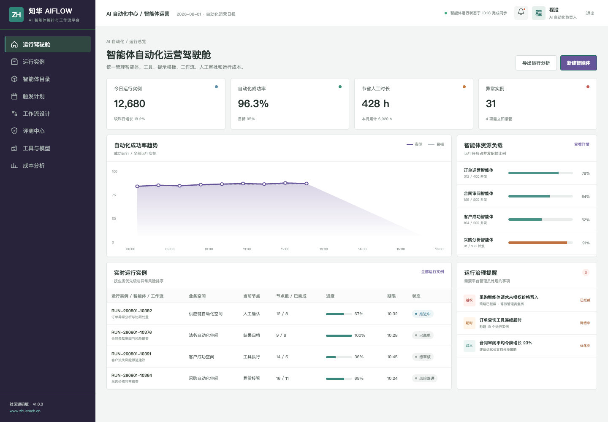
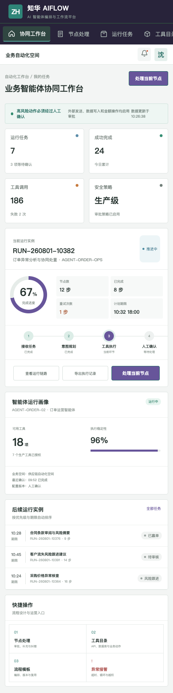

# ZhuaTech AIFlow｜企业 AI 智能体编排与工作流平台

ZhuaTech AIFlow 是知华科技（上海如静知华信息科技有限公司）面向企业自动化场景发布的社区源码版。[访问知华科技官网](https://www.zhuatech.cn/)

## 产品概览

AIFlow 不只是聊天界面，而是一套把模型推理、企业工具、流程节点、人工审批和安全审计组织起来的智能体运行平台。业务团队可以配置目标、工具权限与工作流，平台负责状态追踪、失败重试、成本统计和高风险动作拦截。

| 运营管理端 | 人机协同端 |
| --- | --- |
|  |  |

## 一条受控的执行链路

```text
业务事件 → 意图规划 → 工具调用 → 条件分支 → 人工确认 → 结果归档 → 运行评测
```

- 智能体角色、目标、模型参数、提示版本和工具白名单
- 可视化工作流语义：节点、分支、循环、并行、重试和补偿
- API、数据库和内部系统工具目录及最小权限授权
- 人工审批、敏感动作确认、异常接管和全过程审计
- 运行链路、时延、令牌、成本、成功率与业务收益分析
- 场景评测、版本门禁、灰度发布与安全策略

新增的工作流发布校验会检查重复步骤、未登记工具、外部写操作审批和最小权限风险。校验不通过时返回明确错误清单，阻止有风险的流程进入执行队列。

工作流影响分析进一步比较新版本与运行基线，估算每日模型令牌、重试放大效应和人工复核工时；当复核产能不足时直接标记为阻断，避免“流程能发布、运营接不住”的上线风险。

## 技术说明

| 层次 | 技术实现 |
| --- | --- |
| 服务端 | Java 21、Spring Boot、Spring Security、JWT、JPA、Flyway |
| 管理端 / H5 | Vue 3、Pinia、Vue Router、Axios、Vite |
| 数据与交付 | MySQL 8、H2 Test、Docker Compose、Nginx |

包名为 `cn.zhuatech.aiflow`，默认数据库为 `zhuatech_aiflow`。工程不包含任何第三方模型密钥，模型和工具调用通过 Provider 边界替换。

## 本地体验

```bash
cd frontend && npm install && npm run dev:demo
```

管理端：`planner / Demo@2026`；业务协同端：`operator / Demo@2026`。全栈部署见 [deploy/README.md](deploy/README.md)。所有演示企业、人员和运行数据均为虚构。

## 许可边界

仅允许个人学习、研究和非商业交流，禁止未经授权的商用、生产部署、SaaS 运营、项目交付、品牌替换和商业再分发。商业使用须获得上海如静知华信息科技有限公司书面授权，详见 [LICENSE](LICENSE)。

智能体平台、企业自动化、私有化部署和深度定制，请访问[知华科技官网](https://www.zhuatech.cn/)或扫码联系：

| 技术咨询 | 商务咨询 |
| --- | --- |
|  |  |

SEO：AI Agent 平台、智能体编排、Agent 工作流、企业 AI 自动化、Java AI Agent、Vue 智能体平台、知华科技。
